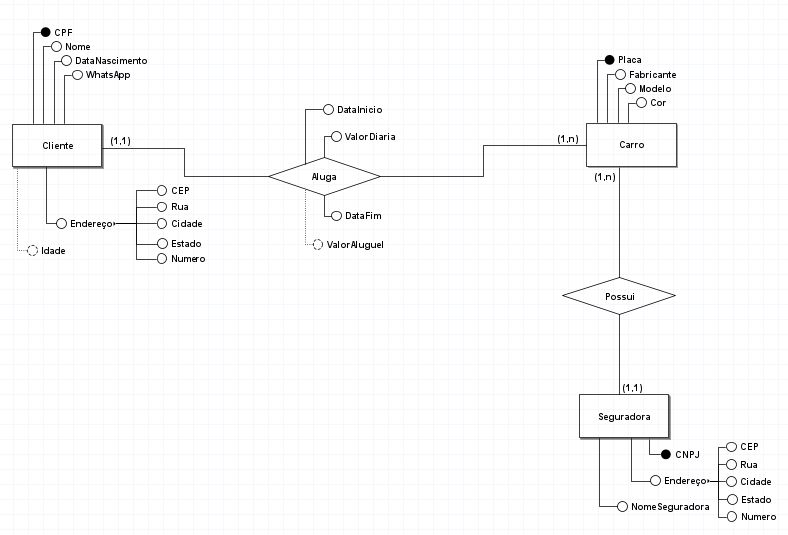
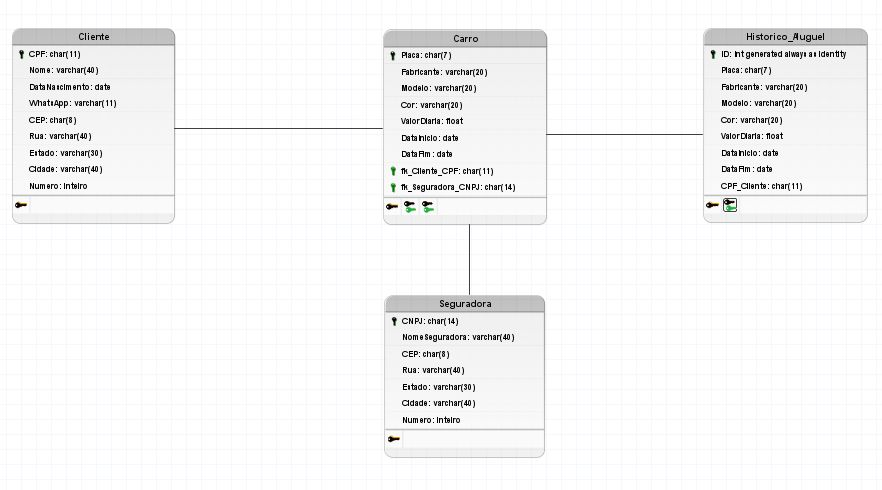

# 🚗 Locadora de Veículos

Projeto acadêmico de **banco de dados relacional para gerenciamento de uma locadora de veículos**, desenvolvido utilizando **PostgreSQL** e **PL/pgSQL**.

O projeto aborda conceitos de modelagem de dados, criação e manipulação de tabelas, relacionamentos, restrições de integridade, consultas SQL, funções, procedures e triggers.

---

## 📋 Sobre o projeto

O banco de dados foi desenvolvido para representar as principais informações envolvidas em uma locadora de veículos, permitindo o gerenciamento de:

* Clientes;
* Veículos;
* Seguradoras;
* Locações;
* Histórico de aluguéis.

O projeto também implementa mecanismos para automatizar determinadas operações e manter informações relacionadas ao histórico das locações.

---

## 🛠️ Tecnologias utilizadas

* **PostgreSQL**
* **SQL**
* **PL/pgSQL**
* **Git/GitHub**

---

## 🧠 Conceitos aplicados

Durante o desenvolvimento foram utilizados conceitos de:

* Modelagem de banco de dados;
* Modelo Entidade-Relacionamento;
* Modelo Relacional;
* Chaves primárias e estrangeiras;
* Integridade referencial;
* Restrições `CHECK`;
* Tipos compostos (`CREATE TYPE`);
* Operações `INSERT`, `UPDATE` e `DELETE`;
* Consultas `SELECT`;
* `ORDER BY`;
* `GROUP BY`;
* `HAVING`;
* Funções;
* Procedures;
* Triggers;
* Manipulação de datas;
* Funções de agregação;
* PL/pgSQL.

---

# 🗂️ Modelagem do Banco de Dados

A modelagem foi desenvolvida a partir da identificação das principais entidades envolvidas no processo de locação de veículos, seus atributos e relacionamentos.

## 📐 Diagrama Entidade-Relacionamento

O **Diagrama Entidade-Relacionamento (DER)** representa as entidades `Cliente`, `Carro` e `Seguradora`, além dos relacionamentos existentes entre elas.

O relacionamento **Aluga** representa a relação entre clientes e carros, enquanto o relacionamento **Possui** representa a relação entre carros e seguradoras.



## 🔗 Diagrama Relacional

O **Diagrama Relacional** apresenta a transformação do modelo conceitual em uma estrutura de tabelas, evidenciando **atributos, chaves primárias e chaves estrangeiras**.

As principais tabelas representadas são:

* `Cliente`;
* `Carro`;
* `Seguradora`;
* `Historico_Aluguel`.



---

# 🗄️ Estrutura do Banco de Dados

## 📍 Tipo composto `ENDERECO`

O projeto utiliza um tipo composto chamado `ENDERECO` para armazenar os dados de endereço.

```sql
CREATE TYPE ENDERECO AS (
    CEP CHAR(8),
    Rua VARCHAR(40),
    Numero INT,
    Cidade VARCHAR(40),
    Estado VARCHAR(30)
);
```

Esse tipo é utilizado nas tabelas `Cliente` e `Seguradora`.

---

## 👤 Tabela `Cliente`

Armazena os dados dos clientes da locadora.

Principais atributos:

* `CPF` — chave primária;
* `Nome`;
* `DataNascimento`;
* `Whastapp`;
* `Endereco`.

A tabela possui restrições para garantir que:

* O cliente tenha pelo menos **18 anos**;
* O CPF possua **11 caracteres**.

---

## 🚘 Tabela `Carro`

Armazena os dados dos veículos disponíveis para locação.

Principais atributos:

* `Placa` — chave primária;
* `Fabricante`;
* `Modelo`;
* `Cor`;
* `ValorDiaria`;
* `DataInicio`;
* `DataFim`;
* `CNPJ_Seguradora` — chave estrangeira;
* `CPF_Cliente` — chave estrangeira.

A tabela possui relacionamentos com `Seguradora` e `Cliente` por meio de chaves estrangeiras.

---

## 🛡️ Tabela `Seguradora`

Armazena os dados das seguradoras associadas aos veículos.

Principais atributos:

* `CNPJ` — chave primária;
* `NomeSeguradora`;
* `Endereco`.

O CNPJ possui uma restrição para garantir o tamanho de **14 caracteres**.

---

## 📜 Tabela `Historico_Aluguel`

A tabela `Historico_Aluguel` é utilizada para armazenar informações relacionadas ao histórico das alterações de aluguel.

Entre os dados armazenados estão:

* Placa;
* Fabricante;
* Modelo;
* Cor;
* Valor da diária;
* Data de início;
* Data de fim;
* CPF do cliente.

O campo `id` é utilizado como chave primária e é gerado automaticamente.

---

# ⚙️ Functions

O projeto implementa funções utilizando **PL/pgSQL**.

## `DIASRESTANTES`

A função `DIASRESTANTES` recebe o CPF de um cliente e retorna a quantidade de dias restantes da locação associada a ele.

O cálculo é realizado comparando a `DataFim` da locação com a data atual do sistema.

---

## `func_historico`

A função `func_historico` é utilizada em conjunto com um trigger para auxiliar na geração do histórico de aluguéis.

A função verifica as alterações relacionadas aos dados da locação e, quando atendida a condição definida no código, insere os dados correspondentes na tabela `Historico_Aluguel`.

---

# 🔧 Procedures

O projeto implementa duas **procedures** para automatizar operações no banco de dados.

## `APAGA_CLIENTE`

A procedure `APAGA_CLIENTE` recebe o CPF de um cliente e realiza sua exclusão da tabela `Cliente`.

Exemplo:

```sql
CALL APAGA_CLIENTE('11111111117');
```

---

## `AlterarNomeSeguradora`

A procedure `AlterarNomeSeguradora` recebe o CNPJ de uma seguradora e um novo nome, realizando a alteração diretamente na tabela `Seguradora`.

Exemplo:

```sql
CALL AlterarNomeSeguradora(
    '11111111111111',
    'SEGURADORA BAHIA'
);
```

---

# 🔄 Triggers

O projeto implementa o trigger:

### `gat_gera_historico`

O trigger `gat_gera_historico` é associado à tabela `Carro` e é executado após uma atualização do campo `CPF_Cliente`.

Sua função é acionar a `func_historico()`, responsável pelo processamento do registro histórico da locação.

```sql
CREATE OR REPLACE TRIGGER gat_gera_historico
AFTER UPDATE OF CPF_Cliente
ON Carro
FOR EACH ROW
EXECUTE FUNCTION func_historico();
```

---

# 🔎 Consultas SQL

O projeto contém diferentes exemplos de consultas e operações para manipulação e análise dos dados, incluindo:

* Consultas com filtros;
* Utilização de `LIKE`;
* Ordenação com `ORDER BY`;
* Agrupamento com `GROUP BY`;
* Filtros de agrupamento com `HAVING`;
* Funções de agregação;
* Manipulação de strings;
* Manipulação de datas.

Entre as funções utilizadas estão:

* `COUNT`;
* `LENGTH`;
* `UPPER`;
* `INITCAP`;
* `SUBSTR`.

---

# 🎯 Objetivos acadêmicos

O projeto foi desenvolvido para colocar em prática conhecimentos de **Banco de Dados**, especialmente:

* Modelagem conceitual e relacional;
* PostgreSQL;
* SQL;
* PL/pgSQL;
* Integridade e restrições de dados;
* Chaves primárias e estrangeiras;
* Tipos compostos;
* Functions;
* Procedures;
* Triggers;
* Consultas e manipulação de dados.

---

## 👨‍💻 Autores

**Pablo Vinícius Rodrigues Barboza**

Estudante de **Engenharia de Computação — UNIVASF**.

**Filipe Alves Ribeiro Rodrigues**

Estudante de **Engenharia de Computação — UNIVASF**.
